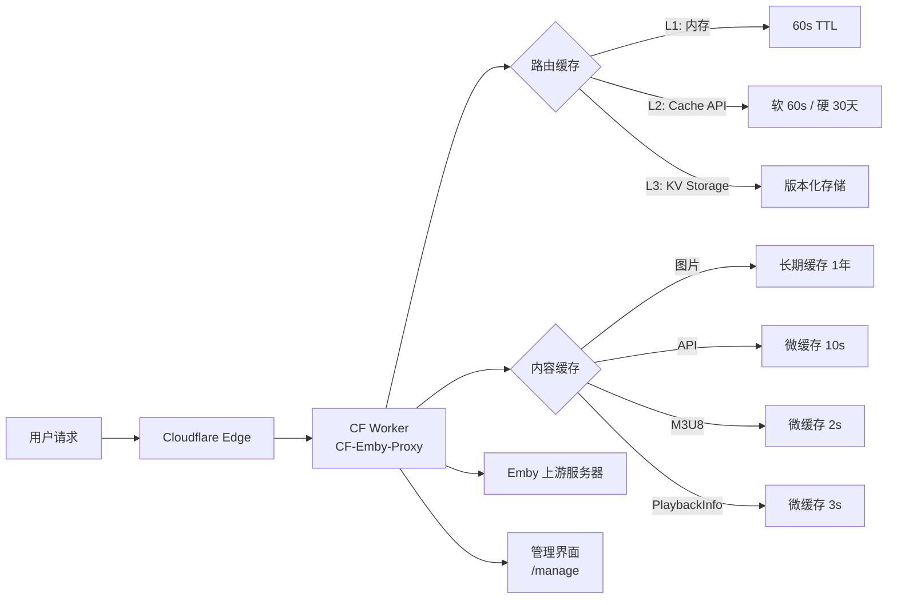

<h1 align="center">CF-Emby-Proxy</h1>

<p align="center">
  <strong>一个部署在 Cloudflare 上的高性能 Emby 代理，内置多层缓存与可视化管理界面，让您的媒体库快如闪电。</strong>
</p>

<p align="center">
  <a href="https://github.com/TimelessXiao/CF-Emby-Proxy"></a>
  <a href="#"></a>
  <a href="#"></a>
  <a href="#"></a>
</p>

---

## ✨ 核心亮点

- 🚀 **多层缓存策略** - 智能利用 Worker 内存、Cloudflare Cache API 和 KV 存储，大幅减少回源请求，提升加载速度
- 🎨 **可视化管理界面** - 内置 `/manage` 管理页面，支持动态路由配置、批量操作、导入导出和版本回滚
- 🛡️ **强化安全机制** - SSRF 防护、凭证保护、缓存隔离，确保代理安全可靠
- ⚙️ **动态路由管理** - 按子域名灵活路由到不同 Emby 上游，支持 pathPrefix 和代理路径模式
- 📊 **性能监控优化** - Server-Timing 注入、媒体播放稳定性优化、Range 请求智能处理

## 🏗️ 架构概览



> **请求流程**：用户请求经 Cloudflare 边缘到达 Worker，Worker 通过三级路由缓存选择上游，并根据内容类型应用不同缓存策略，最终代理到 Emby 服务器或直接返回缓存内容。

---

## 🚀 快速开始

### 前置要求

- Node.js >= 18
- Cloudflare 账户
- npm 或 yarn

### 部署步骤

```bash
# 1. 克隆仓库
git clone https://github.com/TimelessXiao/CF-Emby-Proxy.git
cd CF-Emby-Proxy

# 2. 安装依赖
npm install

# 3. 交互式配置（推荐）
npm run setup
# 脚本会自动完成：Cloudflare 认证、KV namespace 创建、wrangler.json 生成、ADMIN_TOKEN 设置

# 4. 部署到 Cloudflare
npm run deploy

# 5. 访问管理界面
# 打开 https://your-worker-url/manage 开始配置路由
```

---

## 📋 项目结构

```
src/
  worker.js      # 核心代理、缓存、安全与管理 API
  ui.js          # /manage 管理界面 HTML
  debug.js       # Server-Timing 与详细日志工具

scripts/
  setup.js       # 交互式/非交互式初始化脚本

wrangler.json.example  # 示例部署配置（可提交）
wrangler.json          # 本地实际配置（默认 git 忽略）
```

---

## 🛠️ 配置说明

<details>
<summary><strong>点击展开 wrangler.json 配置详情</strong></summary>

### 必须配置

- **kv_namespaces**: 绑定 `ROUTE_MAP` 用于存储路由映射
- **Secret**: `ADMIN_TOKEN` 用于保护管理 API

### 环境变量 (vars)

```json
{
  "UPSTREAM_URL": "https://your-emby-server.com",  // 默认上游（无路由命中时兜底）
  "DEBUG": "false",                                 // 启用调试模式
  "DEBUG_LOG_NON_2XX": "false",                    // 记录非 2xx 详细日志
  "DEBUG_LOG_REDACT": "true"                       // 日志脱敏
}
```

### 可选配置

- `ROUTE_CACHE_HOST`: 路由 L2 缓存 key 的隔离 host（不配则使用内置默认）

### 非交互模式（CI/CD）

当 `CI=true` 或 `SETUP_NONINTERACTIVE=1` 时，setup 脚本支持环境变量配置：

```bash
export KV_NAMESPACE_ID="your-kv-id"
export KV_PREVIEW_ID="your-preview-kv-id"  # 可选
export CLOUDFLARE_API_TOKEN="your-token"   # 可选
export ADMIN_TOKEN="your-admin-token"      # 可选
npm run setup
```

</details>

---

## 🎯 核心功能详解

### 1. 多层路由缓存

路由配置采用三级缓存架构，确保高可用和低延迟：

- **L1 (内存缓存)**: 60 秒 TTL，Worker 实例内存
- **L2 (Cache API)**: 软 TTL 60 秒，硬 TTL 30 天，Cloudflare 边缘缓存
- **L3 (KV Storage)**: 版本化持久存储，支持回滚

### 2. 精细缓存策略

| 内容类型 | 缓存策略 | TTL | 说明 |
|---------|---------|-----|------|
| **图片（带 tag）** | 长期缓存 | 1 年 | immutable，基于 tag 参数 |
| **图片（无 tag）** | 短缓存 | 90 秒 | 匿名请求 |
| **API 端点** | 微缓存 | 10 秒 | query 去噪 + token 隔离 |
| **PlaybackInfo** | 微缓存 | 3 秒 | POST 请求，带 body hash |
| **M3U8** | 微缓存 | 2 秒 | 播放清单 |
| **视频/Range** | 不缓存 | - | 直通上游，优化 TTFB |

### 3. 媒体播放优化

- **TTFB 超时控制**: 默认 15 秒，适配慢速上游
- **智能重试机制**: 网络错误快速重试，带退避策略
- **空闲 watchdog**: 防止播放过程中连接假死
- **原生流直通**: Range 请求和原生播放器（Infuse/ExoPlayer/MPV）绕过 JS 包装，直接透传上游 body

### 4. 动态路由

**常规模式**：按子域名选择上游

```json
{
  "stream1": {
    "upstream": "https://emby-a.example.com",
    "pathPrefix": ""
  },
  "stream2": {
    "upstream": "https://emby-b.example.com",
    "pathPrefix": "/emby"
  },
  "default": {
    "upstream": "https://emby-main.example.com",
    "pathPrefix": ""
  }
}
```

**代理路径模式**：直接代理任意 URL

```
https://proxy.example.com/https://cdn.example.com/video.mkv?sign=xxx
```

### 5. 管理界面与 API

**管理界面**: `/manage` (需要 Bearer Token 认证)

**管理 API**:
- `GET /manage/api/mappings` - 读取当前映射和版本
- `PUT /manage/api/mappings/:sub` - 新增/更新路由
- `DELETE /manage/api/mappings/:sub` - 删除路由
- `POST /manage/api/batch-delete` - 批量删除
- `GET /manage/api/export` - 导出配置
- `POST /manage/api/import` - 导入配置
- `POST /manage/api/rollback` - 回滚到指定版本

**并发写保护**: 通过 `If-Match` + 版本号实现乐观锁，冲突返回 `409 Version conflict`

### 6. 安全策略

- **SSRF 防护**: 代理路径模式仅允许 http/https，拒绝内网/保留地址
- **凭证保护**: 代理模式下剥离 Authorization、Cookie、X-Emby-Token 等敏感头
- **缓存隔离**: 基于 token + deviceId 计算 SHA-256 缓存键，避免跨用户污染
- **协议头治理**: 清理 hop-by-hop headers，降低中间层协议不兼容

## 💻 开发与调试

<details>
<summary><strong>点击展开开发指南</strong></summary>

### 本地开发

```bash
# 启动本地开发服务器
npm run dev

# 访问 http://localhost:8787
```

### NPM Scripts

- `npm run setup` - 初始化环境
- `npm run dev` - 本地开发
- `npm run deploy` - 部署到 Cloudflare

### 调试工具

启用 `DEBUG=true` 后，响应会附带 `Server-Timing` 头：

```
Server-Timing: kind;desc="api", client;desc="client", player_hint;desc="infuse",
               kv_read;dur=5, cache_hit;desc="1", upstream;dur=120,
               retry;desc="0", subreq;desc="1"
```

配合 `wrangler tail` 可实时查看请求日志：

```bash
npx wrangler tail --config wrangler.json
```

### 性能监控

- **采样率**: 默认 10% 请求记录 Server-Timing（媒体请求强制记录）
- **详细日志**: `DEBUG_LOG_NON_2XX=true` 记录非 2xx 响应详情
- **日志脱敏**: `DEBUG_LOG_REDACT=true` 自动脱敏敏感信息

</details>

## 🌟 常见场景

### 多线路分流

将 `a.example.com` 和 `b.example.com` 指向不同 Emby 上游，通过 `/manage` 在线配置，约 60 秒内全局生效。

### 跨域资源代理

使用代理路径模式处理跨域资源：

```
https://proxy.example.com/https://cdn.example.com/video.mkv?token=xxx
```

Worker 会自动处理重定向并继续包裹为代理路径，避免断链。

### 降低首页接口延迟

利用 API 微缓存和 PlaybackInfo 微缓存，减少频繁回源，首页加载速度提升明显。

## ❓ 常见问题

<details>
<summary><strong>Q: 如何更新路由配置？</strong></summary>

访问 `/manage` 管理界面，使用 Bearer Token 认证后即可在线编辑路由。配置会自动同步到 KV 并刷新缓存。

</details>

<details>
<summary><strong>Q: 缓存多久生效？</strong></summary>

路由配置缓存 TTL 为 60 秒，更新后最多 60 秒内全局生效。内容缓存根据类型不同，TTL 从 2 秒到 1 年不等。

</details>

<details>
<summary><strong>Q: 如何回滚配置？</strong></summary>

使用管理 API 的 `/manage/api/rollback` 端点，或在管理界面点击回滚按钮。每次配置更新都会生成新版本，支持回滚到任意历史版本。

</details>

<details>
<summary><strong>Q: 支持哪些播放器？</strong></summary>

支持所有 Emby 官方客户端和第三方播放器（Infuse、ExoPlayer、MPV 等）。对原生播放器会自动启用流直通优化。

</details>

## 📄 许可证

ISC License

---

<p align="center">
  <strong>仓库地址</strong>: <a href="https://github.com/TimelessXiao/CF-Emby-Proxy">https://github.com/TimelessXiao/CF-Emby-Proxy</a>
</p>

<p align="center">
  <strong>运行时</strong>: Cloudflare Workers + Hono | <strong>Node.js</strong>: >= 18
</p>
